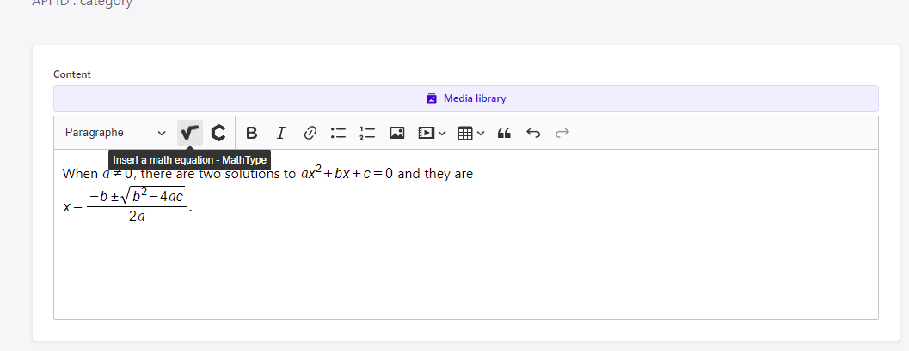

# 🚀 Getting started with Strapi

1: git clone https://github.com/quyen1708/strapi-custom-field-math-type.git

2: Open repository

2: "cd src/plugins/wysiwyg"

3: run "npm install"

4: "cd ../../.." (You will in strapi-custom-field-math-type)

5: "npm install or yarn"

6: run: "npm run develop --watch-admin" or "yarn develop --watch-admin"

7: Create new content-type and new field.

8: Field "Rich text" now will be custom CKEditor with math type and chem type.

